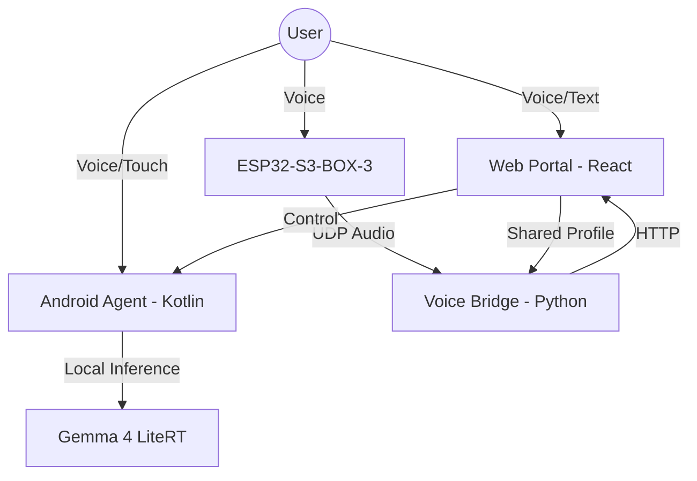

# 📂 GemCode Documentation Index

Welcome to the technical documentation for the GemCode ecosystem. This folder contains hardware configurations, firmware specifications, and detailed guides for the various sub-systems.

## 🎙️ Voice & Hardware (ESPHome)
GemCode supports the **M5Stack ESP32-S3-BOX-3** as a primary voice interface.

| File | Purpose | Status |
| :--- | :--- | :--- |
| [gemcode_box3_ptt.yaml](gemcode_box3_ptt.yaml) | Push-To-Talk (PTT) firmware. Optimized for low-latency voice commands. | **Stable** |
| [gemcode_box3_wake.yaml](gemcode_box3_wake.yaml) | Wake-Word firmware ("OK Gemma"). Requires `micro_wake_word` model. | **Experimental** |
| [gemcode_box3_ptt.yaml](gemcode_box3_ptt.yaml) | Native ESPHome integration for testing audio components. | Developer Only |

## 📖 Detailed Guides
*   **[VOICE_PE_GEMCODE.md](VOICE_PE_GEMCODE.md)**: Comprehensive guide on how the Voice Physical Entity (PE) interacts with the Python Bridge and the Web UI.
*   **[DESKTOP_AVATAR_COMPANION.md](DESKTOP_AVATAR_COMPANION.md)**: Integration guide for the Desktop Companion (screen capture + avatar).
*   **[PRODUCT.md](PRODUCT.md)**: The technical "White Paper" and long-term roadmap of GemCode.

## 🛠️ Setup & Configuration
- **[secrets.example.yaml](secrets.example.yaml)**: Template for your local WiFi and API keys. Copy this to `secrets.yaml` before flashing.
- **`secrets.yaml`**: (Local Only) Your private configuration. **Never commit this file.**

---

## 🏗️ System Architecture

